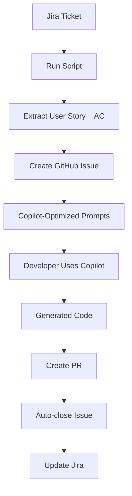

# GitHub Copilot Integration Workflow

## Overview

This improved workflow creates a **GitHub Issue** from your Jira ticket and lets **GitHub Copilot** generate the implementation code. This approach is cleaner and more aligned with GitHub's native development workflow.

## How It Works



## Step-by-Step Process

### 1. Create GitHub Issue from Jira

```bash
npm run jira-to-issue JGIT-1 nataliarusu/a11y
```

**What this does:**
- ✅ Reads Jira ticket (user story + acceptance criteria)
- ✅ Creates GitHub Issue with Copilot-optimized content
- ✅ Moves Jira ticket to "In Progress"
- ✅ Links Jira ↔ GitHub for full traceability
- ✅ Provides step-by-step instructions for developers

### 2. Developer Workflow with GitHub Copilot

The created GitHub Issue contains everything needed for Copilot:

#### A. Structured Content for Copilot
```markdown
## 🤖 GitHub Copilot Instructions

### Use Copilot Chat for Implementation
@workspace Implement the following user story with all acceptance criteria:

**User Story:** [Extracted from Jira]

**Requirements:**
- AC1: [Acceptance Criterion 1]
- AC2: [Acceptance Criterion 2]
- AC3: [Acceptance Criterion 3]

**Technical Requirements:**
- Use TypeScript for type safety
- Include comprehensive error handling  
- Add JSDoc comments for all public methods
- Follow clean architecture principles
- Include unit tests with high coverage
```

#### B. Ready-to-Use Copilot Prompts
The issue includes pre-written prompts optimized for GitHub Copilot Chat.

#### C. Implementation Checklist
Each acceptance criterion gets its own checklist item that developers can track.

### 3. Code Generation with Copilot

Developer opens VS Code and:

1. **Creates feature branch**: `git checkout -b feature/jgit-1-implementation`

2. **Uses Copilot Chat** with the provided prompts:
   ```
   @workspace [Pre-written prompt from the issue]
   ```

3. **Copilot generates**:
   - Main implementation files
   - Type definitions/interfaces  
   - Unit tests
   - Integration tests
   - Documentation

4. **Verifies each AC** with Copilot assistance

### 4. Create Pull Request

When implementation is complete:

```bash
git add .
git commit -m "Implement [JGIT-1] User story implementation"
git push origin feature/jgit-1-implementation
```

Create PR with:
- **Title**: `[JGIT-1] User story implementation`
- **Body**: Include `Closes #123` (issue number)
- **AC Verification**: Checklist showing each AC is satisfied

### 5. Automatic Linking

When PR is merged:
- ✅ GitHub Issue automatically closes
- ✅ Jira ticket can be updated via webhook
- ✅ Full traceability: Jira → GitHub Issue → PR → Code

## Benefits of This Approach

### ✅ Better Developer Experience
- **Native GitHub workflow** - developers work in familiar GitHub Issues
- **Copilot optimized** - content specifically structured for AI assistance
- **Clear instructions** - step-by-step guidance for implementation
- **No server required** - simple script execution

### ✅ Improved Code Quality  
- **Structured prompts** - better input = better AI output
- **AC-driven development** - each criterion becomes a specific requirement
- **Built-in testing** - Copilot generates tests alongside implementation
- **Documentation included** - comprehensive docs generated automatically

### ✅ Perfect Traceability
```
Jira Ticket → GitHub Issue → Feature Branch → Pull Request → Merged Code
     ↓              ↓              ↓              ↓           ↓
Requirements → Implementation → Development → Review → Production
```

### ✅ Team Collaboration
- **GitHub native** - comments, reviews, discussions in GitHub
- **Issue tracking** - GitHub's project management tools
- **PR reviews** - standard GitHub review workflow
- **Integration ready** - works with existing GitHub Actions, etc.

## Usage Examples

### Basic Usage
```bash
npm run jira-to-issue JGIT-1 nataliarusu/a11y
```

### With Multiple Repositories
```bash
# Frontend implementation
npm run jira-to-issue JGIT-1 nataliarusu/frontend

# Backend API
npm run jira-to-issue JGIT-1 nataliarusu/api

# Mobile app  
npm run jira-to-issue JGIT-1 nataliarusu/mobile
```

### Full Development Cycle
```bash
# 1. Create GitHub Issue from Jira
npm run jira-to-issue JGIT-1 nataliarusu/a11y

# 2. Developer implements with Copilot (in VS Code)
# - Uses provided Copilot prompts
# - Generates implementation + tests
# - Creates PR with "Closes #123"

# 3. PR merged → Issue closed → Jira updated
```

## Configuration

### Required Environment Variables
```bash
# Jira Configuration
JIRA_DOMAIN=your-company
JIRA_EMAIL=your-email@company.com  
JIRA_API_TOKEN=your-jira-token

# GitHub Configuration
GITHUB_TOKEN=your-github-token

# Optional: Lead Engineer Assignment
PROJECT_LEAD_GITHUB=lead-username
```

### GitHub Token Permissions
- `repo` - Full repository access
- `issues` - Create and manage issues
- `pull_requests` - Create and manage PRs

## Sample Generated GitHub Issue

```markdown
## 🎯 User Story
As a user, I want to filter search results by category so that I can find relevant items faster.

## 📝 Description  
Users should be able to select one or more categories to filter their search results...

## ✅ Acceptance Criteria

### AC1: Category Filter Display
- [ ] Implementation completed
- [ ] Tests written and passing  
- [ ] Code reviewed

### AC2: Multiple Selection Support
- [ ] Implementation completed
- [ ] Tests written and passing
- [ ] Code reviewed

### AC3: Filter Persistence
- [ ] Implementation completed
- [ ] Tests written and passing
- [ ] Code reviewed

## 🤖 GitHub Copilot Instructions

**This issue is optimized for GitHub Copilot code generation.**

### Use Copilot Chat for Implementation
@workspace Implement the following user story with all acceptance criteria:

**User Story:** Filter search results by category

**Requirements:**
- Display category filter options in UI
- Support multiple category selection
- Persist filter state across page refreshes
- Update search results in real-time

[Detailed prompts and technical requirements...]

## 🔗 Links
- **Jira Ticket:** [JGIT-1](https://company.atlassian.net/browse/JGIT-1)
- **Priority:** High
- **Issue Type:** Story
```

## Comparison: Old vs New Approach

| Aspect | Old (Direct PR) | New (GitHub Issue) |
|--------|-----------------|-------------------|
| **Workflow** | Script → PR | Script → Issue → Copilot → PR |
| **Developer UX** | Complex script output | Native GitHub workflow |
| **Code Quality** | Basic templates | AI-optimized generation |
| **Traceability** | Limited | Full Jira ↔ GitHub ↔ Code |
| **Team Collaboration** | Server-based | GitHub-native |
| **Maintenance** | High (server required) | Low (simple scripts) |
| **Copilot Integration** | Manual | Optimized prompts included |

## Next Steps

1. **Try the new script**:
   ```bash
   npm run jira-to-issue JGIT-1 nataliarusu/a11y
   ```

2. **Open the created GitHub Issue** in VS Code

3. **Use GitHub Copilot Chat** with the provided prompts

4. **Experience the improved workflow** - from Jira ticket to production code

This approach gives you the best of both worlds: **automated Jira integration** with **native GitHub development workflow** enhanced by **AI-powered code generation**.
